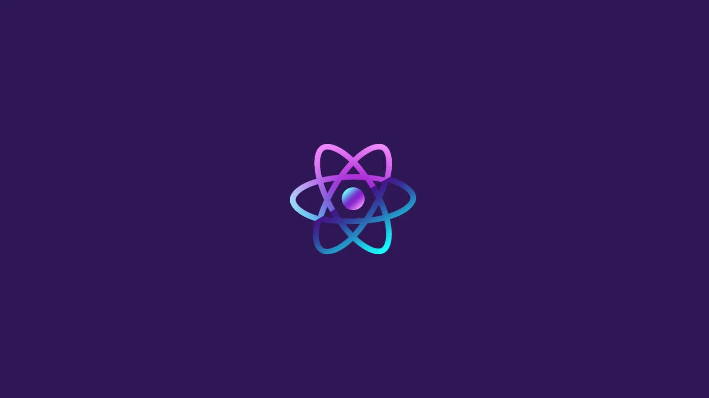

  

<h1 align="center">Hi 👋, I'm Thanh Dat</h1>

<h3 align="center">A Web Developer</h3>

  

<h2 align="center">🔥Technologies and Tools🔥</h2>

  
  &nbsp;
  
  &nbsp; 
  
  &nbsp; 
  
  &nbsp;
  
  &nbsp;
  
  &nbsp;
  
  &nbsp;
  
  &nbsp;
  
  &nbsp;
  
  &nbsp;
  
  &nbsp;
  
  &nbsp;
  
  &nbsp;
    
  &nbsp;
  
  &nbsp;
  
  &nbsp;
  
  &nbsp;
  
  &nbsp;
  
  &nbsp;
  
  &nbsp;
  
  &nbsp;
  
  &nbsp;
  
  &nbsp;
  
  &nbsp;
  
  &nbsp;

